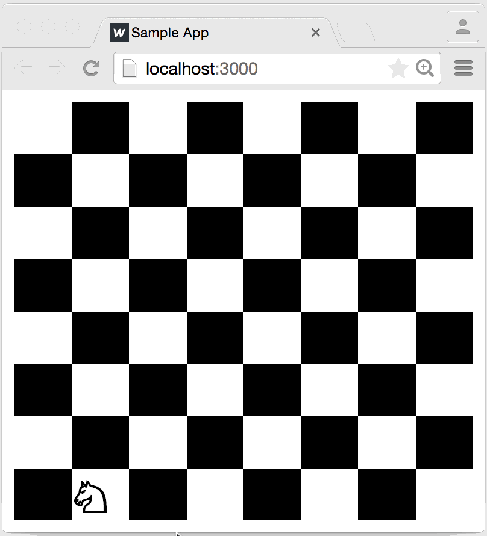

# Chess Board (React Drag & Drop)

| In this React project, I explore the drag-and-drop capabilities of <a href="http://react-dnd.github.io/react-dnd">React DnD</a> while using Flexbox to build a simplified chess board containing a single set of pieces. |
|:-|

<details>
<summary>Inspired by and adapted from <a href="http://react-dnd.github.io/react-dnd/docs/tutorial">Dan Abramov's tutorial</a>. </summary>
This app was initially inspired by and adapted from <a href="http://react-dnd.github.io/react-dnd/docs/tutorial">Dan Abramov's tutorial</a> (i.e. React DnD's creator), where a lonely knight roams about the chess board freely. One of my goals is to implement drag-and-drop capabilities for all of the knight's buddies so they too can roam about.
</details><br>

<p align="center">
  <a href="">
    
  </a>
</p>

---

## Chess Board Pre-Analysis

### Identify components and consider props.

| Components | Description | Props |
|:-|:-|:-|
| **`Knight`** | A single knight piece. | Probably needs no props. There's no need for it to be aware of its own position since it'll be placed into `Square` as a child. |
| **`Square`** | A single square on the board. | Probably just **`color`** (alternating in white and black), as it is the only value needed for rendering. It's not necessary to give position via props.
| **`Board`** | The entire 8x8 board with 64 total squares. | `Board` only consists of `Square` components, therefore instead of passing `Square` components to `Board` as children, `Board` would probably just own them. This means `Board` would then need `Knight`'s **current position**, a two-item array with a column (**`x`**) and row (**`y`**) position. |

#### Where will the current state live?

If it can be helped, not `Board`. It's a good idea to have as little state in components as possible. Since `Board` will already have some layout logic, it's best to not burden it with managing state. However, for this simple demo, it's rather trivial at this point. Let's assume state exists *somewhere* and think about it later. Meanwhile, let's make sure the components render correctly when they receive said state via props.

The goal is to make `Knight` draggable. This requires maintaining `knightPosition` in some kind of state storage and having some way to update it.

React is not opinionated about the state management or the data flow (e.g. Flux, Redux, Rx).

---

# Infrastructure

The project's `src` structure and a brief description of each file.

```
src
├── App.jsx                     # wraps the board component with an observer
├── components
│   ├── board
│   │   ├── Board.jsx           # renders an 8x8 board component
│   │   ├── Square.jsx          # renders square and children on it (e.g. knight)
│   │   └── SquareWrapper.jsx   # handles drag-and-drop logic for moving piece
│   ├── constants
│   │   └── ItemTypes.js        # constants for the draggable item types
│   ├── layout
│   │   ├── Footer.jsx
│   │   └── Header.jsx
│   ├── pieces
│   │   └── Knight.jsx          # uses unicode knight to render a chess piece
│   └── util
│       ├── KnightObserver.js   # manages game state, updates knight position
│       └── Overlay.jsx         # highlights squares for possible moves
├── index.js                    # defines the app's entry point
├── lib
│   └── withDragDropContext.js  # initializes a single DragDropContext instance
└── stylesheets
    └── global.css              # normalizes some styling
```

# Dependencies

| API | Description |
|:-|:-|
| [gh-pages](https://pages.github.com/) | Deployment tool that publishes GitHub repo as a static website directly to GitHub Pages. |
| [react-dnd](https://react-dnd.github.io/react-dnd/) | Set of higher-order components for React that help build complex drag-and-drop interfaces. |
| [react-dnd-html5-backend](http://react-dnd.github.io/react-dnd/docs/backends/html5) | Official HTML5 backend for React DnD. [No longer a required peer dependency](https://github.com/react-dnd/react-dnd/releases/tag/v4.0.6) as it is currently legacy and has been integrated into [react-dnd](https://react-dnd.github.io/react-dnd/). |
| [react-dnd-touch-backend](https://github.com/yahoo/react-dnd-touch-backend) | Touch back-end for [react-dnd](https://react-dnd.github.io/react-dnd/) (since native drag-and-drop is not currently supported in touch devices). |

---

# Create React App

<details>
<summary>This project was bootstrapped with <a href="https://github.com/facebook/create-react-app">Create React App</a>.
</summary><br>

## Available Scripts

In the project directory, you can run:

### `npm start`

Runs the app in the development mode.<br>
Open [http://localhost:3000](http://localhost:3000) to view it in the browser.

The page will reload if you make edits.<br>
You will also see any lint errors in the console.

### `npm test`

Launches the test runner in the interactive watch mode.<br>
See the section about [running tests](https://facebook.github.io/create-react-app/docs/running-tests) for more information.

### `npm run build`

Builds the app for ptoweruction to the `build` folder.<br>
It correctly bundles React in ptoweruction mode and optimizes the build for the best performance.

The build is minified and the filenames include the hashes.<br>
Your app is ready to be deployed!

See the section about [deployment](https://facebook.github.io/create-react-app/docs/deployment) for more information.

### `npm run eject`

**Note: this is a one-way operation. Once you `eject`, you can’t go back!**

If you aren’t satisfied with the build tool and configuration choices, you can `eject` at any time. This command will remove the single build dependency from your project.

Instead, it will copy all the configuration files and the transitive dependencies (Webpack, Babel, ESLint, etc) right into your project so you have full control over them. All of the commands except `eject` will still work, but they will point to the copied scripts so you can tweak them. At this point you’re on your own.

You don’t have to ever use `eject`. The curated feature set is suitable for small and middle deployments, and you shouldn’t feel obligated to use this feature. However we understand that this tool wouldn’t be useful if you couldn’t customize it when you are ready for it.

## Learn More

You can learn more in the [Create React App documentation](https://facebook.github.io/create-react-app/docs/getting-started).

To learn React, check out the [React documentation](https://reactjs.org/).

### Code Splitting

This section has moved here: https://facebook.github.io/create-react-app/docs/code-splitting

### Analyzing the Bundle Size

This section has moved here: https://facebook.github.io/create-react-app/docs/analyzing-the-bundle-size

### Making a Progressive Web App

This section has moved here: https://facebook.github.io/create-react-app/docs/making-a-progressive-web-app

### Advanced Configuration

This section has moved here: https://facebook.github.io/create-react-app/docs/advanced-configuration

### Deployment

This section has moved here: https://facebook.github.io/create-react-app/docs/deployment

### `npm run build` fails to minify

This section has moved here: https://facebook.github.io/create-react-app/docs/troubleshooting#npm-run-build-fails-to-minify

</details>

---

# React DnD Overview

React DnD uses Redux internally, so it shouldn't be a coincidence that its underlying concepts resemble its architecture.

## Backends

**React DnD is built on top of the HTML5 drag-and-drop API.**

Pro: no need to *draw* as the cursor moves, "drag preview" works out of the box.
Con: no built-in touch screen support.

**Backends abstract away the browser differences and process the native DOM events.**

The backends perform a similar role to that of React's synthetic event system: they abstract away the browser differences and process the native DOM events. Despite the similarities, React DnD backends do not have a dependency on React or its synthetic event system. Under the hood, all the backends do is translate the DOM events into the internal Redux actions that React DnD can process.

## Items + Types

**The types let you specify which drag sources and drop targets are compatible.**

React DnD uses data, and not the views, as the source of truth. When you drag something across the screen, we don't say that a component, or a DOM node is being dragged. Instead, we say that an item of a certain type is being dragged. Describing the dragged data as a plain object helps you keep the components decoupled and unaware of each other.

Types are useful because, as your app grows, you might want to make more things draggable, but you don't necessarily want all the existing drop targets to suddenly start reacting to the new items.

## Monitors

**The monitors let you update the props of your components in response to the drag and drop state changes.**

Drag and drop is inherently stateful. Either a drag operation is in progress, or it isn't. Either there is a current type and a current item, or there isn't. This state has to live somewhere. React DnD exposes this state to your components via a few tiny wrappers over the internal state storage called the monitors.

For each component that needs to track the drag and drop state, you can define a collecting function that retrieves the relevant bits of it from the monitors. React DnD then takes care of timely calling your collecting function and merging its return value into your components' props.

## Connectors

**The connectors let you assign one of the predefined roles (a drag source, a drag preview, or a drop target) to the DOM nodes in your render function.**

If the backend handles the DOM events, but the components use React to describe the DOM, how does the backend know which DOM nodes to listen to? Enter the connectors.

## Drag Sources and Drop Targets

**Drag sources and drop targets are the primary abstraction units of React DnD, i.e. they really tie the types, the items, the side effects, and the collecting functions together with your components.**

Whenever you want to make a component or some part of it draggable, you need to wrap that component into a drag source declaration. Every drag source is registered for a certain type, and has to implement a method producing an item from the component's props. It can also optionally specify a few other methods for handling the drag and drop events. The drag source declaration also lets you specify the collecting function for the given component.

The drop targets are very similar to the drag sources. The only difference is that a single drop target may register for several item types at once, and instead of producing an item, it may handle its hover or drop.

## Higher-Order Components and Decorators

**A higher-order component is just a function that takes a React component class, and returns another React component class.**

The wrapping component provided by the library renders your component in its render method and forwards the props to it, but also adds some useful behavior.

In React DnD, DragSource and DropTarget, as well as a few other top-level exported functions, are in fact higher-order components. They breathe the drag and drop magic into your components.

---
